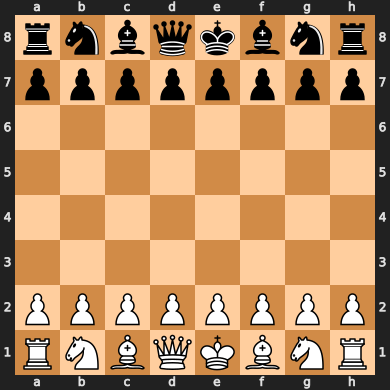

# Mediocre Neural Network Chess AI
> Building a chess engine using neural networks and nbdev :)

Building it from the ground up and as code along with George Hotz and his twitchchess see: 
https://youtu.be/RFaFmkCEGEs

---
TODOs
- [x] Establish nbdev
- [x] Build dataset and generate data.
- [x] Establish a neural network
- [] Roll out search beyond 1 move
- [x] Train on more data
- [] Add RL self learning support

## Implementation

It is a simple 1 look ahead neural network value function. The trained net is in nets/value.pth. It takes in a serialized board and outputs a range from -1 to 1. -1 mean black wins, 1 means white wins, 0 is a draw.
